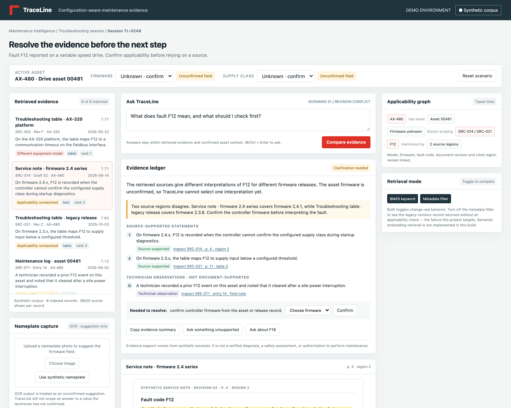
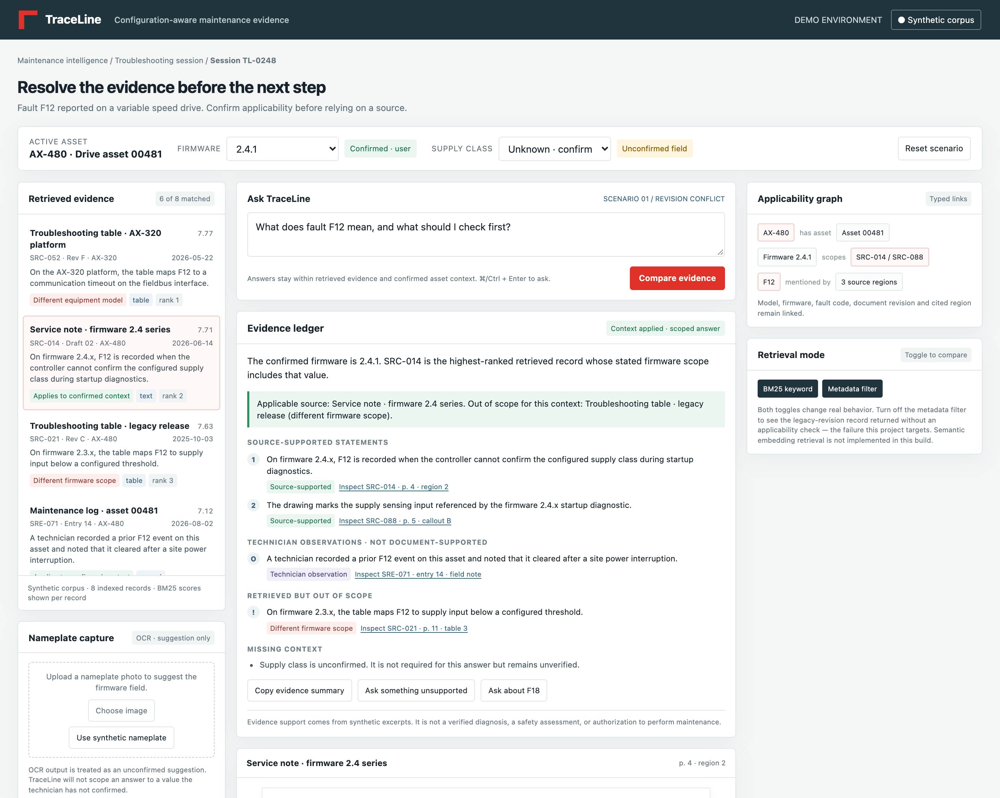
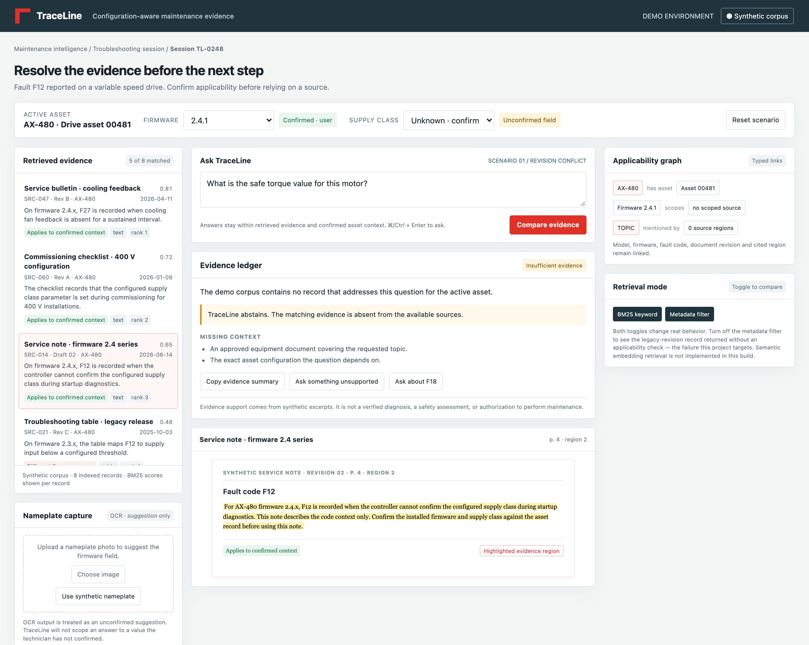
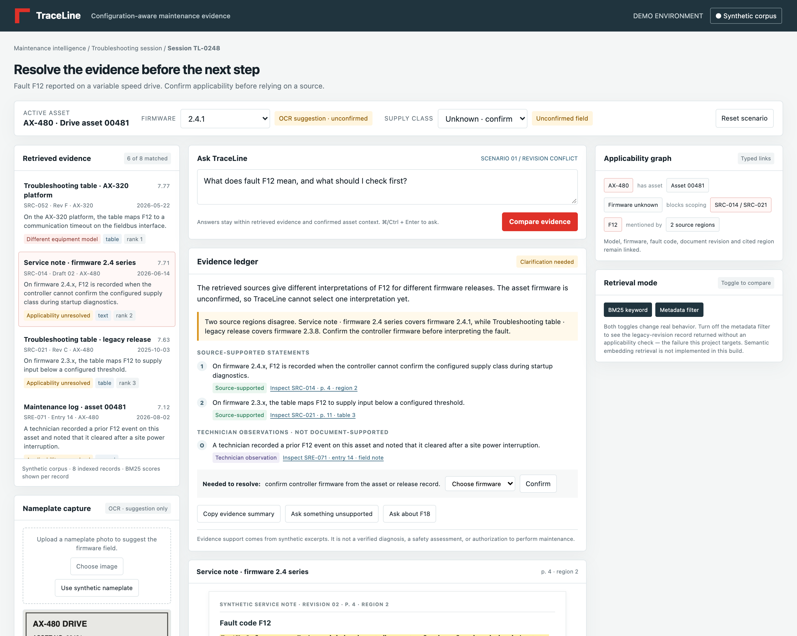
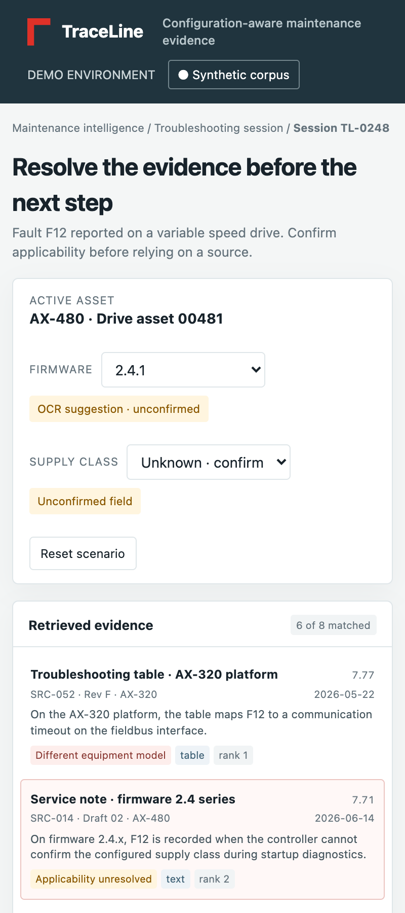

# TraceLine

A browser prototype for configuration-aware maintenance evidence. It targets one
documentation failure that hides behind a convincing citation: **a real statement
from the wrong equipment revision.**

Ask it about fault F12 on a drive whose firmware is unconfirmed and it will not
answer. It shows you that two source regions disagree, tells you which
configuration field would settle it, and waits.

## Live demo

<https://juliaj3.github.io/traceline-prototype/> — fully static, served straight
from this repository.

## Run it locally

```
git clone https://github.com/JuliaJ3/traceline-prototype.git
cd traceline-prototype
python3 -m http.server 8000
```

Open `http://localhost:8000`. No build step, no API keys, no database, no
install. One optional network fetch: the OCR engine loads from a CDN on first
use, and the rest of the app works without it. Do not open `index.html` over
`file://` — ES modules will not load.

Full setup, troubleshooting and a step-by-step verification walkthrough:
[`TECHNICAL_DOCUMENTATION.md`](TECHNICAL_DOCUMENTATION.md#setup-instructions).

## Run the tests

```
node --test tests/engine.test.mjs
```

41 tests, ~120 ms. They cover the retrieval, applicability and abstention rules
directly, without a browser.

## What to try

| Action | What it demonstrates |
|---|---|
| Ask the default F12 question with firmware Unknown | Two records disagree. TraceLine cites both and picks neither. |
| Confirm firmware **2.4.1** | The answer scopes to the 2.4.x record and marks the legacy table *Different firmware scope*. |
| Confirm **2.3.8** instead | The scope inverts. No record is ever both cited and excluded. |
| Click **Use synthetic nameplate** | OCR reads a generated nameplate and *suggests* firmware. The ledger stays at *Clarification needed* until you confirm it. |
| Click **Ask something unsupported** | Abstention, with the missing evidence named. |
| Ask about fault **F91** | Abstains rather than citing a record that merely contains the word "fault". |
| Turn off **Metadata filter** | The applicability check is removed and an AX-320 record is cited for an AX-480 asset — the failure this project exists to prevent. |

## What is actually implemented

- **BM25 retrieval** (k₁ = 1.4, b = 0.72) over eight synthetic records, with
  per-record scores visible in the interface.
- **Exact-identifier handling.** A query naming a fault code restricts citable
  records to carriers of that code, so generic wording cannot promote an
  unrelated document.
- **Applicability verdicts** derived from record metadata: `applicable`,
  `out-of-model`, `out-of-firmware`, `out-of-supply`, `unresolved`. "Unresolved"
  means *no verdict is available yet*, which is not the same as failing.
- **Metadata-derived conflict detection** — same fault code, disjoint firmware
  scopes, differing claims. Nothing is hardcoded by record id.
- **Typed field provenance** — `system`, `user`, `ocr`, `unknown`. Only `system`
  and `user` count as confirmed.
- **Client-side OCR** (Tesseract.js) of a nameplate image, treated as a
  suggestion that never scopes an answer until a technician confirms it.
- **Documented claims separated from field observations.** A technician's log
  entry is shown, labelled, and excluded from both conflict pairing and cited
  support.
- **Abstention** that names what is missing, including a distinct
  "evidence exists but for a different equipment model" verdict.
- Citation links that open the cited excerpt and mark its region.

## What is not implemented

No semantic embeddings or vector store — retrieval is lexical only, and the
interface says so. No PDF parsing, no real table or diagram extraction, no LLM
call, no backend, no authentication, no persistence. The diagram regions are
human-authored fixtures, not computer vision output.

## Scope

Concept prototype, not a diagnostic tool. Every equipment identifier, document
title, excerpt, date and revision is synthetic. Nothing here is reproduced from
manufacturer documentation, and no claim of ABB integration or endorsement is
made. TraceLine does not control equipment or certify that an action is safe.

## Files

| Path | Contents |
|---|---|
| `index.html` | Markup, styles, entry point |
| `engine.js` | Retrieval, applicability, conflict detection, abstention — no DOM |
| `app.js` | Rendering, event wiring, OCR intake, firmware parsing |
| `tests/engine.test.mjs` | 41 unit tests |
| `PROJECT_SUMMARY.md` | Project summary: problem, solution, impact |
| `TECHNICAL_DOCUMENTATION.md` | Architecture, technologies, implementation approach, setup |
| `DEMO_SCRIPT.md` | Timed walkthrough |
| `EVALUATION.md` | Verification performed and proposed benchmark |
| `assets/` | Screenshots of each demonstrated state |

## Screenshots

| | |
|---|---|
|  | **Unresolved conflict.** Both records cited, neither chosen, firmware named as the deciding field. |
|  | **After confirmation.** Scoped to the 2.4.x record; the legacy table is excluded with its reason shown. |
|  | **Abstention.** No claims, missing evidence named. |
|  | **OCR suggestion, unconfirmed.** The ledger has not changed. |
|  | **400px width.** |
